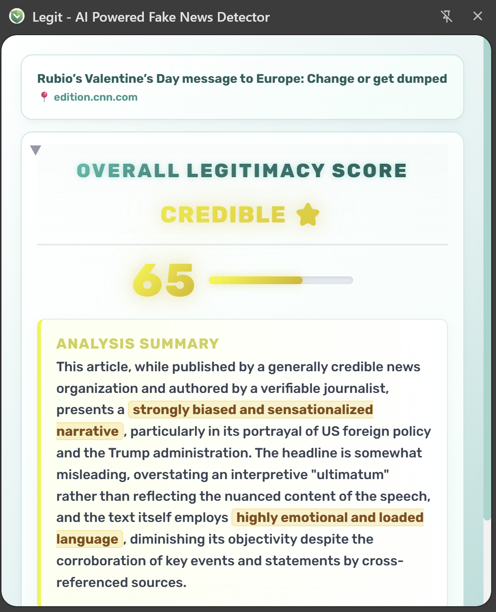
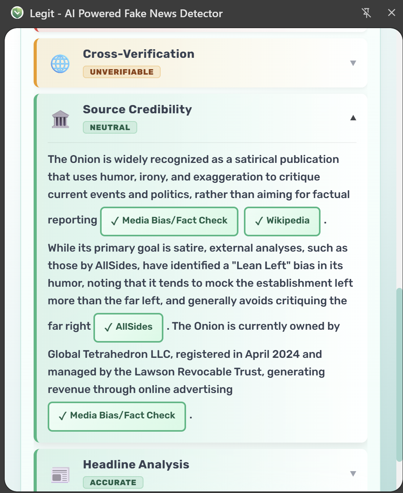
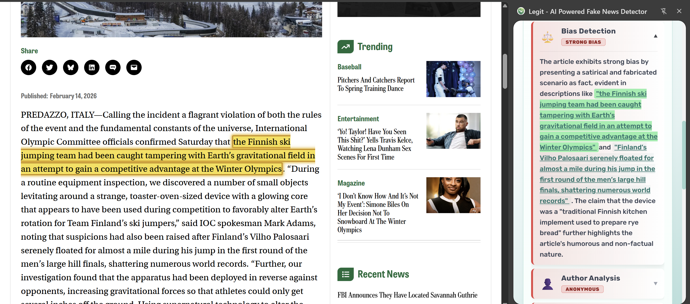

# Legit - AI-Powered News Credibility Verifier

<div align="center">
  
  <br />
  
  **Instantly verify news credibility, detect bias, and cross-reference sources using a multi-agent AI system directly in your browser.**
  
  [](https://developer.chrome.com/docs/extensions/mv3/intro/)
  [](https://deepmind.google/technologies/gemini/)
  [](LICENSE)
</div>

---

## 🎓 Academic Context

**This project was developed at the [Technion - Israel Institute of Technology](https://www.cs.technion.ac.il/), Faculty of Computer Science.**

It was created during the **Winter 2025-2026** semester.
* **Developers:** Daniel Ben Zeev & Moshe Aizenfratz
* **Supervisors:** Prof. Omri Ben-Eliezer & Dr. Oren Mishali

---

## 📖 About The Project

**Legit** is a Chrome Side Panel extension designed to combat misinformation and media bias using advanced Large Language Model (LLM) analysis. Unlike simple fact-checkers, Legit employs a **Multi-Agent Architecture** where specialized AI personas analyze different aspects of a news article simultaneously.

When you analyze a page, Legit extracts the content and dispatches it to agents specializing in **Source Verification (SIFT method)**, **Author Background**, **Consensus Checking**, **Bias Detection**, and **Linguistic Analysis**. The results are aggregated into a weighted credibility score, providing a forensic breakdown of the content you are reading.

---

## ✨ Key Features

Here is how Legit helps you navigate the news landscape:

### 1. 🕵️‍♂️ Multi-Agent Analysis Engine
Don't rely on a single opinion. Legit deploys a team of AI agents to investigate the article from multiple angles: source history, author credibility, and factual consensus.
<div align="center">
  
  <br><em>View a comprehensive breakdown of the article's credibility score.</em>
</div>

### 2. 🧠 Smart Context Search (SIFT)
The agents don't just read the text—they browse the web. Using "Lateral Reading" techniques, the system actively cross-references claims against trusted external sources to detect misinformation.
<div align="center">
  
  <br><em>See exactly which sources support or contradict the claims.</em>
</div>

### 3. 🔦 Fuzzy Quote Highlighting
Found a suspicious claim in the analysis? Click it. Our robust **Levenshtein Distance** algorithm instantly scrolls to and highlights the exact sentence in the article, even if there are formatting differences.
<div align="center">
  
  <br><em>Interactive highlighting brings the analysis to life inside the article.</em>
</div>

### 4. 🌍 Localization & RTL Support
Fully optimized for global use with native support for **Hebrew** (Right-to-Left UI) and **English**, including localized prompts and interface elements.
<div align="center">
  
</div>

---

## 🤖 Meet the Agents

Legit uses a "Mixture of Agents" approach. Each agent has a specific persona and responsibility. You can view the specific prompt engineering and logic for each agent in our codebase.

| Agent Name | What it does (The "Human" Explanation) | Code Reference |
| :--- | :--- | :--- |
| **The Investigator**<br>*(Source Verification)* | Checks the publisher's history. Is this a satire site? Is it state-sponsored? Does it have a history of failing fact-checks? | [View Prompt Logic](https://github.com/dandan64/Project_Legit/blob/6d72faab23fbcfa65f194da6af498caab67b7438/scripts/agents.js#L14C8-L56) |
| **The Profiler**<br>*(Author Analysis)* | Looks up the writer. Do they exist? Are they a subject matter expert or a bot? Checks their digital footprint. | [View Prompt Logic](agents.js) |
| **The Fact-Checker**<br>*(Consensus)* | Takes the main claims and checks if Tier-1 news outlets (AP, Reuters, etc.) agree. Detects if a story is "breaking news" with unverified details. | [View Prompt Logic](agents.js) |
| **The Psychologist**<br>*(Bias & Style)* | Analyzes *how* the article is written. It looks for emotionally manipulative language, logical fallacies, and rage-baiting tactics. | [View Prompt Logic](agents.js) |

---

## 🛠️ Tech Stack

* **Platform**: Chrome Extension (Manifest V3)
* **Core Logic**: Vanilla JavaScript (ES6+)
* **AI Backend**: Google Gemini API (Model: `gemini-2.5-flash`)
* **UI/Styling**: CSS3 (Glassmorphism, CSS Variables, Animations), HTML5
* **Content Extraction**: [Readability.js](https://github.com/mozilla/readability)
* **Storage**: `chrome.storage.local` with Quota Management

## 🚀 Getting Started

### Prerequisites

* **Google Chrome** or **Microsoft Edge** (Chromium based).
* A **Google Gemini API Key** (Free tier available). [Get one here](https://aistudio.google.com/app/apikey).

### Installation

1.  **Clone the Repository**
    ```bash
    git clone [https://github.com/yourusername/legit-extension.git](https://github.com/yourusername/legit-extension.git)
    cd legit-extension
    ```

2.  **Load into Chrome**
    * Open Chrome and navigate to `chrome://extensions/`.
    * Toggle **Developer mode** (top right corner).
    * Click **Load unpacked**.
    * Select the directory where you cloned the repository.

3.  **Setup**
    * Open the Chrome Side Panel (click the square icon next to your profile or press `Ctrl+B`).
    * Select "Legit" from the dropdown.
    * Enter your **Gemini API Key** and click Save.

## 💡 Usage

1.  Navigate to any news article (e.g., CNN, BBC, Fox News, or a blog).
2.  Open the **Legit** Side Panel.
3.  Click **"Analyze This Page"**.
4.  **View Results**:
    * **Overall Score**: A weighted 0-100 score indicating trustworthiness.
    * **Agent Breakdown**: Click on individual agents to read detailed findings.
    * **Interactive Quotes**: Click on highlighted quotes in the analysis to find them in the text.
    * **Source Links**: Click on Green (Supporting) or Red (Contradicting) source links to verify claims externally.

## ⚙️ Architecture

The project follows a modular pattern:

* **`popup.js`**: Handles the main UI logic, orchestrates the analysis flow, and renders results.
* **`agents.js`**: Defines the "System Instructions" and "Prompts" for each AI agent (Source, Author, Bias, etc.).
* **`background.js`**: Acts as the bridge to the Gemini API, handles rate limiting, and manages the caching layer.
* **`contentHighlighter.js`**: Injected into the page to perform fuzzy text matching and DOM manipulation for highlighting.

## 📄 License

Distributed under the MIT License. See `LICENSE` for more information.

## 📧 Contact

* **Names:** Daniel Ben Zeev, Moshe Aizenfratz.
* **Email:** ddbenzeev@gmail.com , moshoiko2209000@gmail.com 
* **Chrome Extension Link:** [Download Legit from Chrome Web Store](https://chromewebstore.google.com/detail/legit/hpnnojnijcmgfhhpenmfenbcngpckfdh)

---

<div align="center">
  <sub>Built with 💻 and ☕ by Daniel and Mosh</sub>
</div>